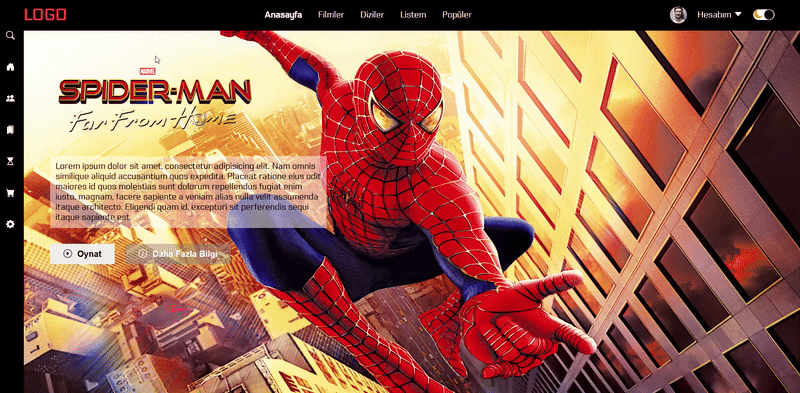

 # Film Sitesi 

📌 Proje Açıklaması
Bu proje, modern web teknolojileri kullanılarak geliştirilmiş tamamen responsive bir film izleme platformudur. Kullanıcı dostu arayüzü ve etkileşimli öğeleriyle öne çıkan bu platform, tüm cihaz boyutlarında sorunsuz çalışmaktadır.

✨ Öne Çıkan Özellikler 
Tamamen Responsive Tasarım: Flexbox ve Grid kullanılarak oluşturuldu

Karanlık/Açık Mod: Kullanıcı tercihine göre tema değiştirme

Film Kategorileri: Popüler, gündemdekiler ve yeni çıkanlar bölümleri

Etkileşimli Film Listeleri: Yatay kaydırılabilir film galerileri

Dinamik Navigasyon: Kullanışlı menü ve sidebar yapısı

🛠 Kullanılan Teknolojiler
HTML5: Semantik yapı
CSS3: Flexbox, Animasyonlar, Media Queries

JavaScript: Dinamik içerik yönetimi

Bootstrap Icons: Modern ikon seti
Google Fonts: Electrolize font ailesi

📱 Responsive Yapı
Proje 3 temel ekran boyutuna göre optimize edilmiştir:

Masaüstü: 800px ve üzeri

Tablet: 500px - 799px

Mobil: 499px ve altı

🎬 Proje Bileşenleri

1. Ana Sayfa
   Fullscreen hero bölümü (Öne çıkan film)

Film filtreleme seçeneği

Kategorilere göre film listeleri

2. Film Listeleri
   Yatay kaydırılabilir film kartları

Film üzerine gelince açılan detay butonları

Sağ/sol kaydırma okları

3. Kullanıcı Arayüzü
   Sabit navbar (üst menü)

Fixed sidebar (yan menü)

Karanlık/aydınlık mod geçişi

Kullanıcı profili alanı

🚀 Kurulum ve Kullanım
Proje dosyalarını bilgisayarınıza indirin

index.html dosyasını herhangi bir tarayıcıda açın

Hiçbir ek kurulum veya bağımlılık gerektirmez

📷 Ekran Görüntüleri

